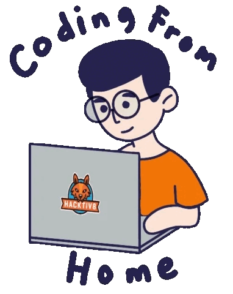

<h1 align="center"><b>🧿 Web Developer 🌠</b></h1>

<br />

<!-- Short Introduction -->

<h1 align = "left">
  Hi, there. 

  ### Welcome to my Git :heart:
</h1>
<p>With over 10 years of experience as a senior full stack developer, my goal is to become a skilled developer for my clients and agency, as well as a valuable contributor to Github.</p>

```yaml

current_job: Full Stack Developer
education:
  [
    "Bachelor's in Computer Science",
  ]
company: Freelancer
technical_skills:
  [
    Basic: ["JavaScript", "TypeScript", "Python", "PHP"]
    Front-End: ["React.js", "Next.js", "Redux Toolkit", "Angular", "Vue", "Nuxt"]
    Back-End: ["Node.js", "Express.js", "Nest.js", "Django", "Laravel"]
    CMS: ["Wordpress", "Drupal", "Shopify"]
    Database: ["MySQL", "PostgreSQL", "MongoDB"]
    DevOps: ["AWS", "Docker", "GCP", "Azure", "Kubernetes"]
    Tools: ["JIRA", "Trello", "Slack"]
  ]
technical_background:
  [
    "Full Stack Developer"
    "DevOps Solutions Architect",
  ]
my development philosophy: ["I can't acclimate with 99.(9)%, Only by sending 100% perfect project my Clients!"]
2024 Goals: ["Create 10+ Projects and learn at least 5 new Technologies."]
hobbies: ["Chess", "LEGO building", "Swimming", "Sketching"]
```
<!-- Skills Section -->
<h2 align="left">🚀Skills🚀</h2>

<div>

#### ⚒Basic Programming Languages:

  <div align="left">
    
    
    
    
    
    
    
  </div>

#### 🛒Frameworks and Skills:

  <div align="left">      
     
    
    
    
    
    
    
    
    
    
    
    
    
    
    
  </div>
  
#### 🎲Database & DevOps & Deploys:

  <div align="left">      
    
    
    
    
    
    
    
    
    
    
    
    
    
    
    
    
  </div>


<div align="center">
<a href="https://github.com/yellowbearpooh0110?tab=stars">

</a>
&nbsp;&nbsp;&nbsp;&nbsp;&nbsp;
&nbsp;&nbsp;&nbsp;&nbsp;&nbsp;
<!--  -->

</div>

<br />

<p align="center">
  
</p>

<br />
<br />
<br />

<a href="https://github.com/ryo-ma/github-profile-trophy">
   
</a>

<br />
<br />


<p align="center">
  
</p>
